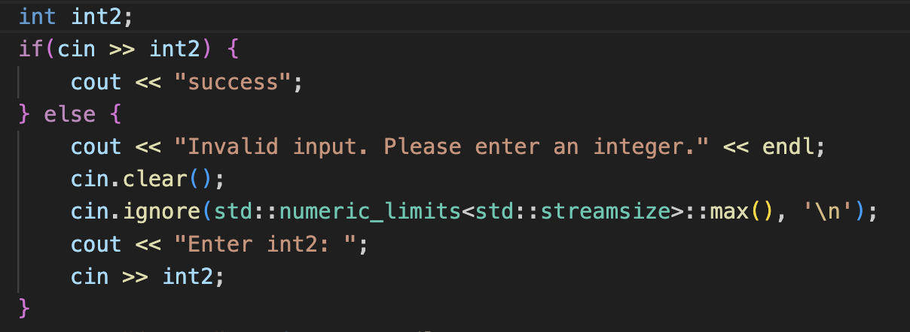
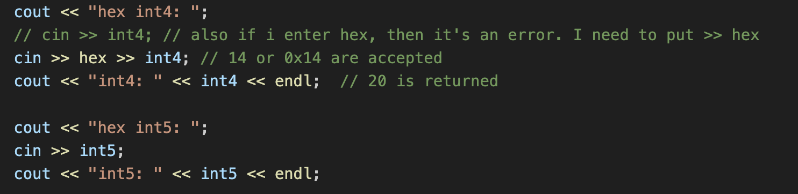
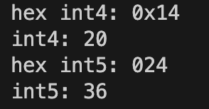

# Doubts

Q) How does the modulo operator work? Check with the following cases p%p, n%n, p%n, n%p. Why is this operator system dependent?

A) If both operands are positive, then the result is positive. However if either of the operand or both the operands are negative, then the result is implementation defined as the action takes as a result of underflow or overflow. So the trend of the modulo operator I observed is that the normal remainder is found, but the sign of the remainder depends on the sign of the numerator: `10%3=1`, `-10%3=-1`, `10%-3=1`, `-10%-3=-1`.

Let's take a look at this case by case to try and understand the math behind it:
- (a) `7%3`: 7/3=2, 2*3=6, 7-6=1, therefore, 7%3 = 1
- (b) `-7%3`: -7/3=-2, -2*3=-6, -7-(-6)=-1, therefore, -7%3 = -1
- (c) `7%-3`: 7/-3=-2, -2*-3=6, 7-6=1, therefore, 7%-3 = 1
- (d) `-7%-3`: -7/-3=2, 2*-3=-6, -7-(-6)=-1, therefore, -7%-3 = -1

So as observed (in simple cases), to obtain `num%denom`, we can first do `num/denom` to obtain `quotient`. Then we do `quotient*denom`  and subtract this from `num` by doing `num-(quotient*denom)` to get the `remainder`. We are using the principle of remainder theorem here: `num=(quotient*denom)+remainder`.


Q) How does an assignment statement work when it part of another statement or an expression? Are the new values changed in real-time if it is compounded with the same variable?

A) So an assignment expression in a statement changes the value of the variable in real-time. However, if the same variable is used multiple times, then the value of the variable can be very different at different instances in the same expression. It may depend on the order of presedence, and associativity, or might be totally unspecified.

For example, we have `int y=10, z=5;` at ALL instances. The following expressions will lead to their respective outcomes: 
- `(y=(y+z)+(y=2))` => y=(**10**+5)+(**2**) -> y=17
- `(y=(y=2)+(y+z))` => y=(**2**)+(**2**+5) -> y=9
- `(y=(y+z)+(y=2)+y-4)` => y=(**10**+5)+(**2**)+**2**-4 -> y=15
- `(y=(y=2)+(y+z)+y-4)` => y=(**2**)+(**2**+5)+**2**-4 -> y=7

However, here it doesn't appear that the `()` is getting evaluated first. For example:
- `(y=y-4+(y=2)+(y+z))` => y=**10**-4+(**2**)+(**2**+5) -> y=15 

Another example is `i=i++`. The final value of i is ambiguous because the increment is not guaranteed to be executed before the assignment.

**The order in which different sub-expressions are evaluated is not necessarily specified. Hence it is highly advisable to avoid expressions where the value of a variable changes multiple times.**

Q) When we perform `3.0+9`, the `9` is implicitly casted into a `9.0`. Therefore, is new memory allocated for this `9.0` as well? How does the memory management work in type casting? When a variable is type casted, then what is happening in the memory?

A) So type casting doesn't really change the value stored inside the variable that has been typecasted, hence the type of that variable will be the same, and the memory occupied by the variable will be the same. In C++, variables cannot change their type. C++ is a statically typed language, which means that the type of the variable is determined at compile time. What happens when we cast is it changes the interpretation or view of the existing memory contents (value) based on the desired type. Type casting only affects how the value stored in memory is interpreted or treated by the program.

Now, with respect to the example in `3.0+9`, to explain in simple word:
- The integer literal 9 is temporarily converted to a floating-point value.
- Temporary memory is allocated to store the converted floating-point value.
- The addition operation is performed between 3.0 and the converted value using the allocated memory.
- The memory of this converted value is now released once it is used.

Now, note that the representation of int `9` will be differerent from float `9.0` as the representation of floating point numbers is different from that of integers. Therefore when type casting takes places, the original variable or value is not affected, instead the representation of the value is looked at (either temporarily, or stored in a variable if assigned).

Q) Can we type cast a literal value?

A) Yes, we can type cast a literal value. For example, `(double) 8` will yield `8.00000`.

Q) Is temporary memory occupied by the system during the compilation of the C++ file?

A) Yes, temporary memory is used by the system during the compilation of a C++ file. The compiler needs to parse the source code, perform syntax analysis, and generate the corresponding object code or an intermediate representation. This process often requires memory to store the compiler's internal data structures, such as symbol tables, syntax trees, and intermediate code representations. Therefore, there is memory being occupied for all this. However, it is to be noted that this is different from the memory occupied by the objects when the executable file is run. The compilation process itself does not directly affect the runtime memory consumption of the resulting program.

Q) Are literal expressions evaluated at run-time or compile time? 

A) Literal expressions are generally evaluated at compile time itself. For example: in `double timeInMinutes = (double) timeInMilliseconds / (1000 * 60);`, the `1000*60` is evaluated at compile time itself and the new assignment statement is `double timeInMinutes = (double) timeInMilliseconds / 60000;`. What happens during run-time is the overall division since it involves a variable (and the value of that variable will be determined during the run time).

```
  #include <iostream>

  using namespace std;

  int main() {
    int a = 10;
    int b = 20;

    int c = a + b;
    int d = 2+3;

    cout << c << endl;

    return 0;
  }
```

The `a+b` is evaulated at run-time whereas `2+3` is evaluated at compile time. This is because `a` and `b`are variables and their value can change throughout the program. It's an instruction that during run time, find the sum of the values of `a` and `b` and assign that to `c`. The other thing that happens is `2+3` is calculated at compile time as `5`. So the run time instruction is to just assign `5` to `d` (`int d=5;`) and not actually calculating `2+3`.

This depends across compilers, however any half decent compiler will most probably do what's mentioned above.

> Wikipedia speaks literal is a notation for representing a fixed value within a source code.

Q) Any trend or relation observed to overflow/underflow with type casting?

A) So type casting can happen only when there is memory accodation for it in the other type, if not then overflow/underflow occurs. When performing type casting, it is important to consider the range and memory accommodation of the target type. If the value being casted cannot be accommodated within the range of the target type, overflow or underflow may occur.

Q) Difference between implicit cast and explicit cast?

A) Implicit casting is done automatically by the compiler and there is generally no information loss, whereas explicit casting is done by the user and may have data loss. Types of explicit casting: static cast, dynamic cast, const cast, reinterpret cast. For basic conversions, stick to static cast.

Q) When a floating-point value is casted to an integer, is it truncated or rounded off?

A) The value is actually truncated when being converted from a `float` to an `int`. Binary number system can represent only some rational numbers with finite digit count. All floating point numbers cannot be accurately represented. For example `1/5` or `1/3` cannot be accurately represented as a floating-point value. We should be careful about the **roundoff error**. There might be an error resulting from inexact
representation which can accumulate causing round-off of values.

Q) Why is there no unsigned or signed for bool, char, float, etc? Can we do a `long char`?

A) The modifiers signed, unsigned, long, and short can be applied to integer base types. In addition, signed and unsigned can be applied to char, and long can be applied to double.

Q) Can a positive value >> max be positive?

A) Yes! It definitely can. A value more than max (let's say is positive) will start from the negative as it is trying to be wrapped. But then it will eventually come to the positive side. For example, the range of `short` is `[-32768,32767]`.
The following wraps would take place:
  - 32768 -> -32768
  - 32769 -> -32767
  - 32770 -> -32766
  - .
  - .
  - .
  - 65536 -> 0 (32768*2=65536)
  - 65540 -> 4 (+ve value)

Q) What are the 2 maximum values and 2 minimum values for floating point numbers?

A) Let's take the `double` for example. There's a +ve maximum value, +ve minimum value, -ve maximum value, -ve minimum value.
  - (a) `numeric_limits<double>::max()` 
  - (b) `numeric_limits<double>::min()`
  - (c) `-numeric_limits<double>::min()`
  - (d) `-numeric_limits<double>::max()`
  - (a)>(b)>(c)>(d)

Q) What would you like to comment about how compound/complex expressions are evaluated?

A) The rules of precedence followed by associativity are implemented recursively to the most important simple expression in the complex expression.

Q) If a manipulator is not meant for a particular data type, and it is still used, then does an implicit type cast take place?

A) No, an implicit type cast does not take place if a manipulator is not meant for a particular data type. The manipulator will simply be ignored. 

Q) When a value is put in a char that doesn't have an ASCII value associated with it, what happens?

A) Possible outcomes are: 
- wrap-around of the value to get it in the signed or unsigned 1 byte range
- truncation of the value to meet the desired data type
- platform-specific behaviour

Q) Can we use `char` in `setprecision` and `setw` and `int` in `setfill`? What happens when we use a `double`?

A) From my observation, in `setprecision` and `setw` you can put any datatype and it is implicitly type casted into an `int`. However, for `setfill`, only a `char` works. This is perhaps because the range of the char is limited. There are 256 possible values in a byte, but only 128 out of them have valid ASCII values. So if an integral value doesn't have a char associated with it, then what would it setfill with? Did the makers think of this and try avoiding this error with this thought process in their mind?

Q) Does the order of the output manipulators matter?

A) There's no specific order of the output manipulators, but you need to set attributes first before passing the value.

Q) Is any variable in the `main()` function a global variable?

A) Nope. Global variables are defined out of the scope of any function.

Q) Is `6;` a null statement?

A) It is not a null statement, but it is a useless statement. The `6` expression is evaluated, and then not used in any meaningful way.

Q) Does a function or a loop basically have space for just one statement?  A compound or single, but just one statement?

A) Not really, `int main() return 0;` will not work even though it's just a single statement, because the syntax thinks of the `int main()` as a declaration and not a definition.

Q) Can `main` have any other return type or no return type? Can any other number apart from `0` be designated as a success.

A) No! While defining, main must return an int type. This has something to do with how the operating system looks at the final status which generally just takes a simple integer value. I think the system consider's `0` as the success status and anything else as a failure.

- `return 0: ` 
- `return 1: ` 
- `return 'a': `  (here implicit type casting takes place)

Q) There's type casting taking place as we do `char c=33.44;`?

A) Yes, implicit type casting takes place. The 33.44 becomes 33.

Q) What's the simple difference between expressions and statements?

A) An expression is a combination of values, variables, operators, and function calls that evaluates to a single value. It represents a computation or a calculation. Statements, on the other hand, are complete units of code that perform an action or a sequence of actions. They are used to control the flow of execution, define behavior, or perform some operation. Statements do not produce a value themselves, but they may modify the state of a program.

Q) How does the output of floating point values and `setprecision` work?

A) Based on my observations:
- There are 2 ways of outputting a floating-point number: (none), fixed, scientific.
- There is no default by the system, and it uses fixed or scientific based on the type of value
- Generally if the value is too big, or too small, scientific is preferred, otherwise fixed is preferred.
- By default, when no manipulator is explicitly used for floating point values, upto 6 digits totally (before decimal + after decimal) are used. If the value can be represented with ease (with some round off perhaps) then it is represented in a fashion similar to the fixed format. If not, then it is represented in a scientific format. There is no extra padding with zeroes (`0`).
- When the `fixed` mainpulator is explicitly used, then it appears that there are 6 digits after the decimal. There is extra padding with zeroes if all 6 digits after the decimal couldn't be filled.
- In the `scientific` format, it appears that there's one digit before the decimal, and around 6 digits after the decimal followed by an `e` and a `+` or `-` with the exponent power. There is extra padding with zeroes if all 6 digits after the decimal couldn't be filled.
- Now, if these 2 manipulators are explicitly used, then the `setprecision` alters the number of digits after the decimal.
- If these 2 manipulators are not explicitused, then the total number of digits (before decimal+after decimal) will not exceed the integer passed as the argument. It can be lesser number of digits though.
- Whenever precision has to be reduced, there is round-off taking place.

Q) What did you observe about `setw`?

A) The `setw` manipulator waits only for the next valid value and then has to be used again. It basically doesn't change the state of the output stream. The value passed as the argument to the `setw` value manipulator is the minimum value of the width. That is, the padding will be added only if the width passed to `setw` is more than the width of the item. The default padding is whitespace.

Q) How can `fixed` or `scientific` be reset? How can we get rid of `setprecision`?

A) The `fixed` or `scientific` can be reset using `resetiosflags`. For example: `cout << resetiosflags(ios::scientific);`. Based on my observations, the `setprecision` can be rid by passing a negative value as an arugument to it.

Q) What happens to variables that are not initialized?

A) They are initialized to their default values (0) if they are global variables.

Q) What is a namespace?

A) In programming, a `namespace` is a feature that allows you to organize and group related code elements, such as variables, functions, and classes, into distinct named scopes. It is to be noted that it is a keyword.

Q) What happens when a wrong data type has been entered during input?

A) The program might enter undefined behaviour (program might crash, or might speed run, or random values might show up). However, we can place checks for the data type and can ask the user to prompt again. Look at this image and understand how we can check if the correct data type has gone:


Q) Do input manipulators like `hex` or `oct` change the state of the input stream?

A) Yes, there are input manipulators that change the state of the input stream. They work similar to the output manipulators.


In the output image, hexadecimal 14 is entered which translates to 20 decimal. Then it is intended to enter octal 24 is entered with a hope to tranlate to 20 in decimal. However, the input stream takes this as an hexadecimal 24 and translates it to a 36 in decimal.


<!-- how does cout work? like does it convert everything into a string? doesn't seem to be doing that for boolean values.
why does showboolalpha not work with setw whereas noboolalpha works -->