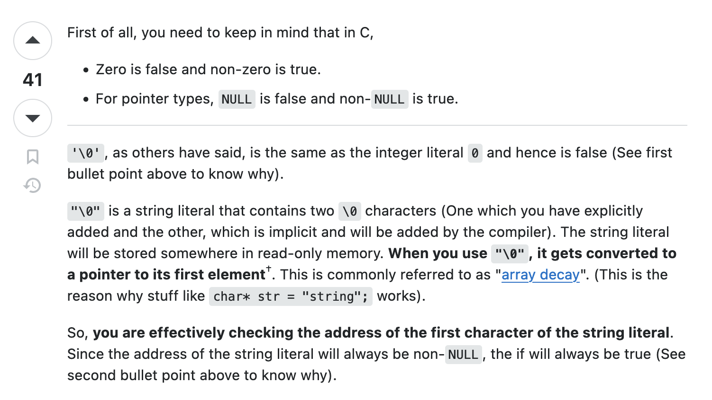

# Doubts

Q) In C++, can a pair of single quotes or double quotes enclose nothing?

A) So as per observations:
- `''` is not valid, there must always be a character enclosed in single quotes.
- `""` is valid, this basically has a NULL character in it. So the length of this string literal is 1.
- `"a"` is a string literal, but `"a"[0]` and `"a"[1]` are chars.

Q) Are these boolean false:
- ' '
- ""
- empty string class
- 0.000
- 0.0001
- uninitialized variable (garbage value) of int, bool, char

A) As per my observations:
- In C++, a character is evaluated to boolean true if its value is not zero and false if its value is zero. 
- `' '` is true
- `'\0'` is false (is NULL character)
- `""` is true (as it means the pointer to the starting character, which is not a NULL ptr)
- `""[0]` is false (is NULL character)
- `"a"[0]` is true (`'a'`)
- `"a"[1]` is false (is NULL character)
- `"\0"` is true (string literal)
- `"\0"[0]` is false (NULL character)
- `"\0"[1]` is true
- A global or static uninitialized variable is automatically initialized to 0, hence it will be false. However, if it is not a global or static one, then the uninitialized variable will have undefined behaviour. Sometimes it might show true, sometimes it might show false.
- `0.0000001` is still true as it's not `0`.
- `0.0000000` is false

For reference: 

Q) Is something of this type possible: `x=if(1) 10;`?

A) No, this is not possible as it expects an expression on the RHS of the assignment operator, and not a value. This why we use the ternary expression as it is an expression: `x=ex1?ex2:ex3`. So here the RHS of the assignment operator will be an expression.

Q) Can we put an if statement in a ternary expression?

A) We cannot directly put it, since it expects expressions and not statements. However, if the if statement is a part of an expression, and provided the overall expressions of the ternary are of the same type, then it may be used. 

Q) Are nested ternary expressions valid?

A) Yes, nested ternary expressions are valid.

Q) Can we put multiple expressions inside ternary expressions?

A) Yes, this is permitted provided the rules of the ternary expression is followed (the overall expressions of the ternary are of the same type). These multiple expressions may be put inside a compound statement, which may be put inside a paranthesis. The overall thing will be now evaluated into an expression. From my observation, all the expressions in the compound statement must be of the same type. They might be typecasted into the same type if legal. This way the overall primary expression (ie everything in the paranthesis) is evaluated. The overall expressions of the ternary are of the same type (ie the type of the value evaluated on both sides of `:` must be the same, or should be in a situation to be legally typecasted).

**As long as the expression can be evaluated (which is the whole point of the expression) into a type, then everything is valid no matter what that expression entails.**

Q) Is something like `a<b<c` legal in C++? Does it to what is intended?

A) The expression `a<b<c` is completely legal in C++. However, we expect it to do `a<b && b<c`, but it ends up doing `(a<b)<c` which results in either `(1)<c` or `(0)<c` which is not we intended to check. Hence, this is not recommended.

Q) What happens when we do something like `false<-3`?

A) We would expect that `-3` is a true value, so true is 1 and false is 0, so we would expect true. But what happens in such expressions is, the bool values are converted to int (1,0). So 0<-3 is false. Remember that integral types are always first casted to an int.

Q) How does `cin` work when we are trying to input multiple things at once?

A) We can use `cin` to input multiple things in one statement. So `cin >> a >>  b >> c` is identical to `cin >> a; cin >> b; cin >> c;`. This is due to a technique called "operator chaining".

Each call to `operator>>(istream&, T)` (where T is some arbitrary type) returns a reference to its first argument. So `cin >> a` returns cin, which can be used as `(cin>>a)>>b` and so forth.

**Note that each call to `operator>>(istream&, T)` first consumes all whitespace characters, then as many characters as is required to satisfy the input operation, up to (but not including) the first next whitespace character, invalid character, or EOF.**

So, the moment it encounters an invalid character for this data type, it tries checking if that invalid character (and onwards) can be put for the next type. If it can, then cool (it might even skip some cin statements). If it can't, then the program crashes.

For example: 
```
    int a; char b,c;
    cin >> b >> c;
    cout << b << endl << c << end;
    cin >> a;
    cout << a << endl;
```

If we input `68244` directly, the 2nd cin is skipped, and b and c are 6 and 8 respectively, and a is 244.
Have a look at this: 
- Code: 
- Output: 

Q) What do `3||5` and `3&&5` return? What happens when we do `1||abcd` where `abcd` is an undeclared identifier?

A) In python we would expect `3 or 5` to give `3`, and `3 and 5` to give `5`. However, in C++, we get `1` in both cases. In C++, `0||5` gives `1`, whereas `0&&5` gives `0`.

In python, if `abcd` is a undeclared identifier, `1 or abcd` will still give us `1`. However, in C++, `1||abcd` will result in a compilation error.

Q) Can the body of the `if` or `else` statement be empty?

A) Yes, it definitely can. All of these statements are valid:

- `if(false) ; else cout << "else\n";`
- `if(true) cout << "if\n" ; else ;` 
- `if(1);else;`
- `if (2) if(4);` = `if (2) { if(4); }`
- `if (2) {}`
- `if (2) if(0); else cout << "zero\n";` = `if(2) { if(0); else { cout << "zero\n"; } }`

Q) Is just `();` an expression?

A) No, there must be something inside the paranthesis.

Q) Does C++ care about indentation? Can the whole code be written in just one line?

A) Not really, the indentation doesn't matter. Now, the whole code may be written in 1 line. However, if we have pre-processor directives or include statements, then there's a requirement for a new line to write the remaining code. So the answer to the second question is both yes, and no. It honestly depends.


Q) Can we give escape sequences as integers? "\12"

Q) `;` ends the statement unless in a compound statement
